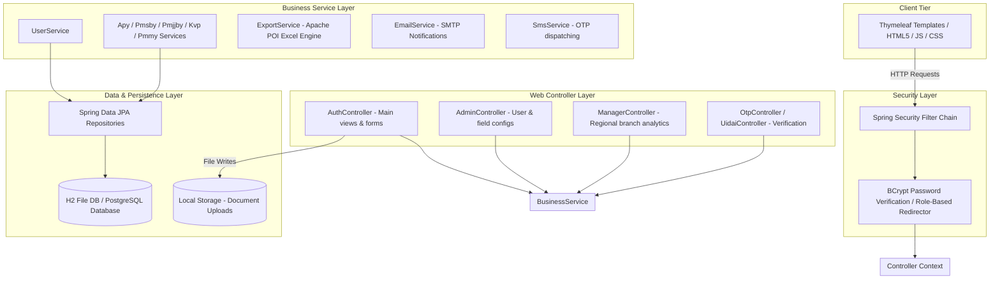
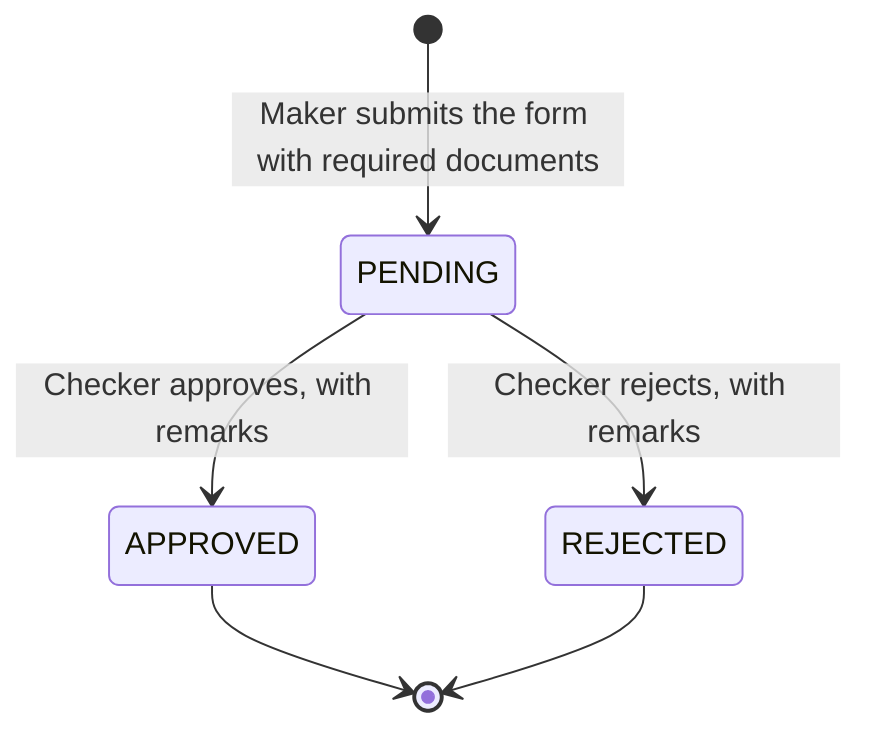
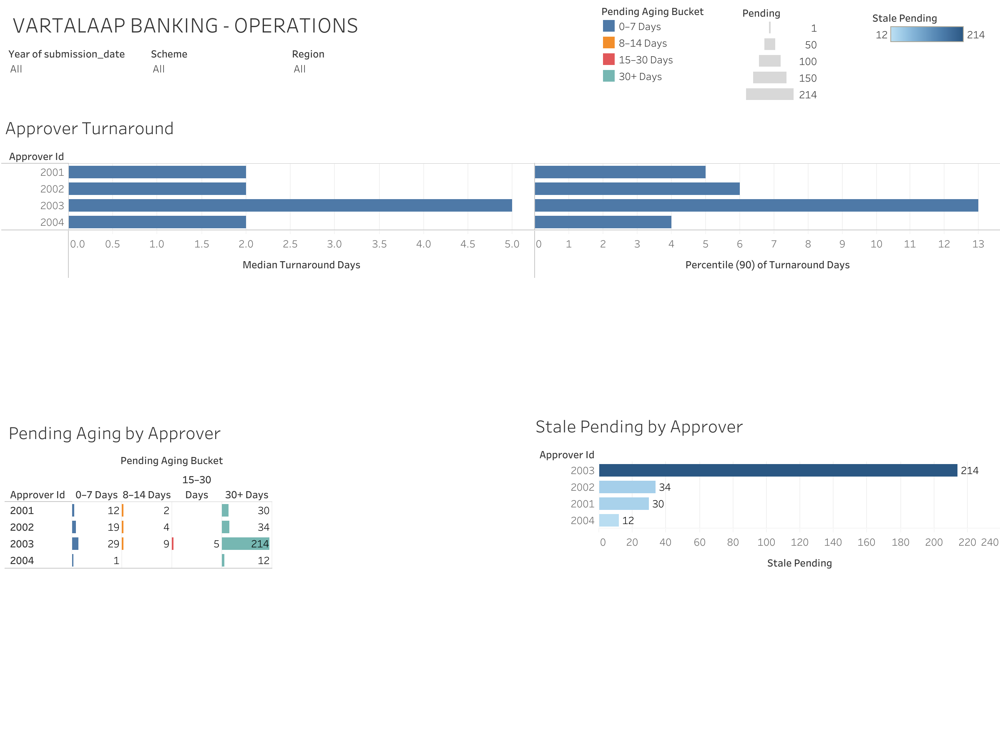

# Vartalaap Banking Portal

Vartalaap is a Spring Boot web portal that helps bank branches digitize and track applications for central government social security schemes — APY, PMJJBY, PMSBY, KVP, and PMMY. Rather than relying on manual paperwork, the system digitizes the entire application lifecycle using a Maker-Checker workflow. Data entered at the branch level by a Maker goes through a formal review process by a Checker before being approved. An accompanying analytics layer (Python, SQL, Tableau) processes the resulting data into branch-level KPIs and interactive dashboards.

> **All analytics data is synthetic.** It was generated to mirror the real schema, with deliberate data-quality problems and business patterns planted to validate the pipeline. See [`analytics/docs/planted_patterns.md`](analytics/docs/planted_patterns.md).

---

## 🚀 Features

- **Maker-Checker Workflow** — status-driven approval flow (Pending → Approved / Rejected) with approver remarks
- **Dynamic Form Engine** — admins can toggle or add custom form fields at runtime without code changes or redeployment
- **Document Upload Pipeline** — UUID-prefixed local file storage; file paths persisted in DB, previewed by Checker in-browser
- **Role-Based Access Control** — four distinct roles (Maker, Checker, Admin, Manager) enforced by Spring Security
- **OTP / UIDAI Verification** — pluggable SMS service (mock for local dev, Fast2SMS for production)
- **Excel Export** — Apache POI engine for consolidated scheme reports
- **Manager Dashboard** — real-time cross-branch performance metrics
- **Analytics Layer** — standalone Python/SQL/Tableau pipeline for application-quality KPIs and business intelligence

---

## 🏗️ Architecture & Application Workflow

### High-Level Architecture

The application follows a standard layered architecture. Requests pass through Spring Security, hit MVC controllers, invoke business logic in service classes, and query the database via Spring Data JPA.



### Application Status Flow

Every application moves through a single-direction status flow:



---

## 🛠️ Tech Stack

| Layer | Technologies |
|:---|:---|
| **Backend** | Java 17, Spring Boot 3.2.3, Spring Security, Spring Data JPA |
| **Frontend** | Thymeleaf, HTML5, CSS, JavaScript |
| **Database** | H2 (file-based, default), PostgreSQL (optional) |
| **Messaging** | JavaMailSender (SMTP), Fast2SMS REST API |
| **Export** | Apache POI (Excel) |
| **Analytics** | Python, Pandas, SQL, Jupyter Notebook, Tableau Public |
| **Build / Tools** | Maven 3.x, Git / GitHub, Docker |

---

## 📊 Analytics & Business Intelligence

The `analytics/` directory contains a standalone data pipeline that processes synthetic banking application data through five stages:

```
Raw banking application data
        ↓
Data cleaning & validation  (exact-duplicate removal, format normalisation,
                             flagging suspect amounts, resubmissions, age issues)
        ↓
Feature engineering         (turnaround days, pending-age buckets, stale flag)
        ↓
SQL / Python analysis       (window-function scorecard, MoM trends, z-score anomaly detection)
        ↓
KPI & performance metrics   (approval rate, rejection reasons, branch rankings)
        ↓
Interactive Tableau dashboards
```

**Pipeline highlights:**

- **Clean without silent deletion** — unambiguous issues are corrected (exact duplicates, format errors); ambiguous ones are flagged and logged to `data/clean/cleaning_log.csv`
- **Audit step** — cleaning decisions are checked against a ground-truth answer key; amount-typo detection achieves 88% recall at 100% precision
- **Anomaly detection** — branch rejection rate versus network rate using z-score (flagged at z > 3)
- **SQL cross-check** — the SQL scorecard is asserted equal to the Pandas scorecard to prevent silent divergence

**Analytics artefacts:**

| Path | Purpose |
|:---|:---|
| `analytics/generate_data.py` | Seeded synthetic data generator (reproducible, seed 42) |
| `analytics/notebooks/01_cleaning_and_analysis.ipynb` | Profiling, cleaning decision log, audit, analysis, SQL, findings |
| `analytics/sql/analysis_queries.sql` | Window-function queries: scorecard, MoM, aging, turnaround, reason share |
| `analytics/data/clean/` | Cleaned fact table and summary tables exported to Tableau |
| `analytics/data/clean/cleaning_log.csv` | Every cleaning decision with rows affected |
| `analytics/docs/data_dictionary.md` | Column definitions, known issues, proposed schema changes |
| `analytics/charts/` | PNG charts used in findings |

**Limitations noted in the pipeline:** `decided_date` and `approver_id` are not in the current Vartalaap schema (proposed additions). Rejection-reason accuracy is higher than a real deployment would show due to the small template set used for synthetic remarks.

---

## 📈 Interactive Analytics Dashboards

The cleaned data is published to three interactive Tableau Public dashboards. All figures below exclude records where Branch = "Unknown".

| Dashboard | Description |
|:---|:---|
| [📈 Executive Overview](https://public.tableau.com/views/Vartalaap_Banking_Application_Analytics/ExecutiveOverview?:language=en-US&publish=yes&:display_count=n&:origin=viz_share_link) | Overall application volume, approval/rejection performance, monthly trends, branch rankings, and scheme-wise distribution |
| [🏢 Branch Drill-down](https://public.tableau.com/views/Vartalaap_Banking_Application_Analytics/BranchDrill-down?:language=en-US&publish=yes&:display_count=n&:origin=viz_share_link) | Branch-level performance, rankings, rejection reasons, and missing-document impact analysis |
| [⚙️ Operations](https://public.tableau.com/views/Vartalaap_Banking_Application_Analytics/Operations?:language=en-US&publish=yes&:display_count=n&:origin=viz_share_link) | Approver turnaround times, pending application aging, and stale-pending workload by approver |

The **Executive Overview** is the primary entry point and covers application volume, approval rates, monthly trends, branch performance, and scheme-wise distribution.

---

## 📸 Dashboard Preview

[](https://public.tableau.com/views/Vartalaap_Banking_Application_Analytics/ExecutiveOverview?:language=en-US&publish=yes&:display_count=n&:origin=viz_share_link)
*📈 Executive Overview — click to open in Tableau Public*

[](https://public.tableau.com/views/Vartalaap_Banking_Application_Analytics/BranchDrill-down?:language=en-US&publish=yes&:display_count=n&:origin=viz_share_link)
*🏢 Branch Drill-down — click to open in Tableau Public*

[](https://public.tableau.com/views/Vartalaap_Banking_Application_Analytics/Operations?:language=en-US&publish=yes&:display_count=n&:origin=viz_share_link)
*⚙️ Operations — click to open in Tableau Public*

---

## 📌 Key Analytics Insights

*(All figures exclude records where Branch = "Unknown". Data is synthetic — see note above.)*

- **12,019 applications** were analyzed after excluding unknown branches.
- **Overall approval rate: 87.4%**
- **371 applications** remain in Pending status.
- **290 applications** are classified as stale pending (aged beyond the expected turnaround window).
- **Median turnaround time: 2 days** across all approvers.
- **Approver 2003** has the highest median turnaround (5 days) and the largest stale-pending workload (214 applications).
- **Manzol** has the highest observed branch rejection rate at **29.6%**.
- **Gurugram Sector 14** has the highest approval rate at **92.1%**.
- Missing documents are a significant rejection category, surfaced through reason-share analysis.

---

## 📁 Project Structure

```
Vartalaap Banking/
├── analytics/                      # Standalone Python/SQL/Tableau analytics pipeline
│   ├── generate_data.py            # Seeded synthetic data generator
│   ├── build_notebook.py           # Rebuilds notebook from source cells
│   ├── requirements.txt
│   ├── data/
│   │   ├── raw/                    # Raw generated data
│   │   └── clean/                  # Cleaned fact table + summary tables (Tableau input)
│   ├── notebooks/
│   │   └── 01_cleaning_and_analysis.ipynb
│   ├── sql/
│   │   └── analysis_queries.sql    # Window-function queries
│   ├── charts/                     # PNG charts from findings
│   └── docs/
│       ├── data_dictionary.md
│       └── planted_patterns.md
├── docs/
│   └── BENCHMARKS.md               # SQL optimisation benchmark results
├── src/
│   └── main/
│       ├── java/com/example/demo/
│       │   ├── config/             # Security, web, async configuration
│       │   ├── controller/         # Route handlers
│       │   ├── dto/                # Data Transfer Objects
│       │   ├── model/              # JPA entities (User, FormConfig, Schemes)
│       │   ├── repository/         # Spring Data JPA interfaces
│       │   └── service/            # Business logic (export, email, SMS)
│       └── resources/
│           ├── application.properties
│           ├── static/             # CSS, client-side JS
│           └── templates/          # Thymeleaf HTML views
├── data/                           # H2 file database (local)
├── uploads/                        # Uploaded PDF/image documents
├── AlterDb.java                    # Manual DB migration helper
├── Dockerfile                      # Multi-stage container build
└── pom.xml
```

---

## ⚙️ Installation & Setup

### Prerequisites

- **JDK 17** or newer
- **Maven 3.x**
- **Python 3.9+** and `pip` (for the analytics layer only)

### Running the Application Locally

```bash
# Download dependencies and compile
mvn clean install

# Start the embedded Tomcat server
mvn spring-boot:run
```

Open **`http://localhost:8080`** in your browser.

> To use the H2 web console locally, set `H2_CONSOLE_ENABLED=true` before starting the app; it is disabled by default.

### Running Tests

```bash
# Run all unit and integration tests (benchmark tests excluded by default)
mvn test

# Run benchmarks explicitly (requires in-memory H2 benchmark profile)
mvn test -Dgroups=benchmark -Dsurefire.excludedGroups="" -Dspring.profiles.active=benchmark
```

### Switching to PostgreSQL

By default the application uses a local H2 file database (`data/demo`). To connect to PostgreSQL, set environment variables before starting:

```bash
export DB_URL=jdbc:postgresql://your-db-host:5432/vartalaap_db
export DB_USERNAME=postgres
export DB_PASSWORD=yoursecurepassword
export DB_DRIVER=org.postgresql.Driver
export DB_DIALECT=org.hibernate.dialect.PostgreSQLDialect

mvn spring-boot:run
```

### Running the Analytics Pipeline

```bash
cd analytics

pip install -r requirements.txt

# Generate synthetic data
python generate_data.py

# (Optional) Rebuild notebook from source cells
python build_notebook.py

# Execute the full analysis notebook
jupyter nbconvert --to notebook --execute --inplace notebooks/01_cleaning_and_analysis.ipynb
```

---

## ▶️ Pre-seeded Credentials for Local Testing

The application seeds three accounts on first boot (see [`DemoApplication.java`](src/main/java/com/example/demo/DemoApplication.java)):

| Role | Username | Password |
|:---|:---|:---|
| Administrator | `admin` | `admin123` |
| Maker | `maker01` | `maker123` |
| Checker | `approver01` | `approver123` |

---

## 🔧 Key Engineering Decisions

### 1. Dynamic Form Engine (No-Migration Schema Strategy)

Government form fields change frequently. Rather than adding a database column per field change and redeploying, the application uses a hybrid approach:

- **Static columns** map standard fields (name, Aadhaar, phone) to entity columns.
- **`FormConfig` table** stores admin-defined custom fields per branch.
- On submit, a JavaScript interceptor serialises all dynamic inputs into a JSON string stored in the entity's `additional_data` column.
- The Checker view deserialises `additional_data` back into readable key-value pairs.

### 2. Document Upload Pipeline

Binary assets (Aadhaar copies, PAN cards, cancelled cheques) are stored on the local filesystem, not in the database:

- Files are saved to `uploads/` with a UUID prefix to prevent name collisions.
- Only the relative path string is persisted in the DB; Thymeleaf renders the document preview directly.

### 3. Pluggable SMS / OTP Service

Configured via `sms.provider` in `application.properties`:

- `mock` — `MockSmsService` prints the OTP to stdout; no external API needed for local dev.
- `fast2sms` — `Fast2SmsService` sends real SMS via the Fast2SMS REST API.

### 4. Analytics Query Optimisation

`AnalyticsService.getBranchRankings()` was refactored from in-memory Java aggregation to a single native SQL `UNION ALL` + `GROUP BY` query:

| Implementation | Mean Time | Hibernate Queries | Entities Loaded |
|:---|:---|:---|:---|
| Legacy (Java aggregation) | ~54 ms | 6 | 50,050 |
| Optimised (SQL `GROUP BY`) | ~1 ms | 1 | 0 |

The ~54× speedup comes from eliminating entity hydration — materialising 50,050 JPA objects on every dashboard request is expensive regardless of database speed. Full results: [`docs/BENCHMARKS.md`](docs/BENCHMARKS.md).

---

## 🔗 Diagnostic Endpoints

| Endpoint | Purpose |
|:---|:---|
| `http://localhost:8080/h2-console` | H2 web console (JDBC URL: `jdbc:h2:file:./data/demo`, User: `sa`, Password: blank) |
| `http://localhost:8080/api/health` | JSON health check — confirms database connectivity |

---

## 👨‍💻 Author

**Adi Kansal**
